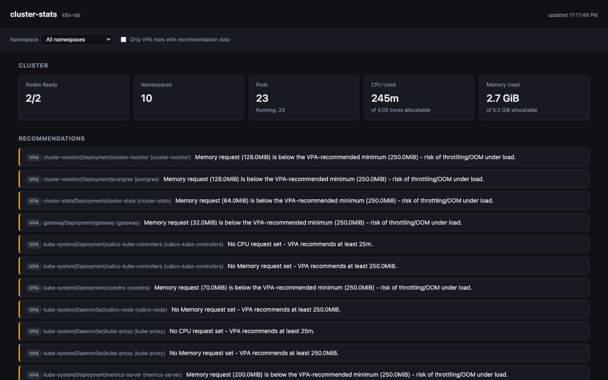
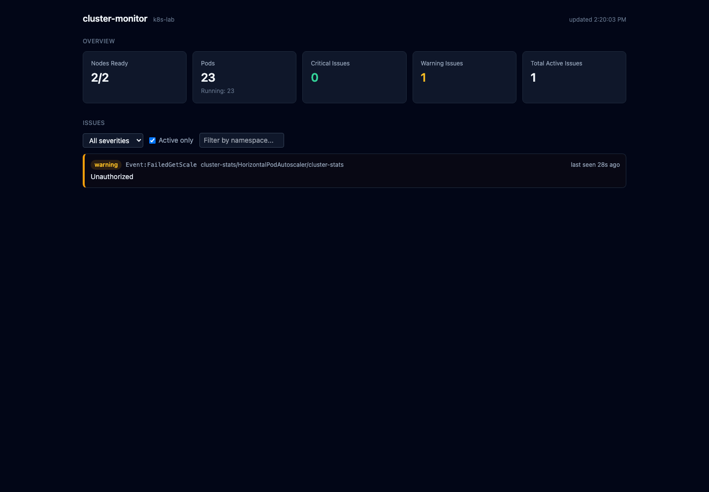

# k8s-lab

A fully-automated local Kubernetes lab: a real 2-node `kubeadm` cluster,
a build/registry server, and an external monitoring stack, all running
as VirtualBox VMs on one Mac via Vagrant - plus two apps deployed onto
it. `vagrant up` alone reproduces the whole thing from nothing.

## Topology

| VM | IP | Role |
|---|---|---|
| `k8s-master` | `192.168.56.10` | control-plane node |
| `k8s-worker1` | `192.168.56.11` | worker node |
| `buildserver` | `192.168.56.20` | Docker registry (`:5000`) + build tools (Docker, Ansible, Helm, JDK) |
| `monitoring` | `192.168.56.21` | Prometheus (`:9090`) + Grafana (`:3000`), watching the cluster from outside it |

## Quickstart

```bash
git clone --recurse-submodules <this repo's URL>
cd k8s-lab
vagrant up | tee logs/vagrant-up.log
```

(`--recurse-submodules` matters - `observability-platform` is a git
submodule, a separate repo in its own right.)

That's it - no manual `kubeadm init`/`kubeadm join`, no manual
docker-compose. On a fresh `vagrant up`:

- **`k8s-master`** runs `kubeadm init`, installs Calico (pod CIDR
  `10.244.0.0/16` - chosen to not collide with the `192.168.56.0/24`
  node network), and installs metrics-server, the Kubernetes Dashboard,
  and the RBAC/`cluster-observability.yaml` manifests under
  `k8s-manifests/`.
- **`k8s-worker1`** waits for the master's join command (dropped in
  `shared_folder/`, which every VM shares) and joins automatically.
- **`buildserver`** starts a local Docker registry on port `5000`
  that both cluster nodes' containerd already trusts without TLS
  (`provisioning/common.sh`), plus a generic build-and-push helper any
  app in this repo can use.
- **`monitoring`** starts Prometheus + Grafana via docker-compose,
  scraping the cluster from *outside* it - node-exporter and
  kube-state-metrics, both exposed by `cluster-observability.yaml` -
  deliberately external, so monitoring survives even if the cluster
  itself is having a bad day. Grafana comes with two dashboards
  (Node Health, Kubernetes Cluster State) auto-provisioned from files,
  `admin`/`admin` on first login.
- A host-side Vagrant trigger copies the admin kubeconfig to
  `~/.kube/config` and labels `k8s-worker1`, so `kubectl` on your Mac
  just works afterwards - nothing to copy by hand.

Every provisioning script is idempotent: re-running `vagrant provision`
(or a whole `vagrant up` after a reboot) detects existing state and
skips rather than re-initializing or breaking anything.

## What's running

**Cluster add-ons** (cluster-wide, not app-specific):
- Calico (CNI), metrics-server, Kubernetes Dashboard (read-only +
  admin logins, see `k8s-manifests/README.md`), `local-path-provisioner`
  (default StorageClass), VPA recommender (recommendation-only - see
  below).

**Three apps**, each deployed the same way (build on `buildserver` →
push to its registry → pre-pull onto cluster nodes → `kubectl apply`):

| App | What | URL | Docs |
|---|---|---|---|
| [`observability-platform`](observability-platform/) *(submodule)* | Anomaly detection for time-series metrics - FastAPI + TimescaleDB + Redis + a scikit-learn worker | `192.168.56.11:30080` | its own README; deploy flow in [`k8s-manifests/README.md`](k8s-manifests/README.md) |
| [`cluster-stats`](cluster-stats/) | Full cluster observability app - node/namespace/pod resources, workload health, HPA status, VPA min/max recommendations | `192.168.56.11:30090/stats/` | [`cluster-stats/README.md`](cluster-stats/README.md) |
| [`cluster-monitor`](cluster-monitor/) | Intelligent issue detection - CrashLoopBackOff, OOMKilled, NodeNotReady, high CPU/mem, and more, with full history in Postgres. React/Vite/Tailwind + FastAPI + official `kubernetes` Python client | `192.168.56.11:30090/monitor/` | [`cluster-monitor/README.md`](cluster-monitor/README.md) |

`cluster-stats` and `cluster-monitor` share one port through
[`gateway`](gateway/) - a small nginx reverse proxy, path-routed
(`/stats/`, `/monitor/`). Both Services are `ClusterIP`, not directly
exposed - see [`gateway/README.md`](gateway/README.md) for why a
straight merge into one backend wasn't an option (their APIs already
collide on `/api/cluster/summary`) and how the path routing actually
works. `observability-platform` isn't behind it (yet) - still its own
NodePort.

### Screenshots

**cluster-stats** (`/stats/`) - cluster/namespace/node resources,
workload health, and VPA/HPA recommendations (see
[`cluster-stats/README.md`](cluster-stats/README.md#screenshots) for
every section captured individually - Resource/Cost Optimization,
Nodes, Namespaces, Workloads, HPA, VPA, Pods):



**cluster-monitor** (`/monitor/`) - detected issues, live:



### Roadmap: deeper analysis

The "Top 5" analysis priorities, agreed up front to keep this from
becoming one enormous change - all five are now built, each as its own
complete increment (built, tested, deployed, documented separately):

- [x] **Resource Optimization** - `cluster-stats`' `/api/optimization`,
      see [`cluster-stats/README.md`](cluster-stats/README.md#resource-optimization-apioptimization-build_resource_optimization)
- [x] **Scheduling Analysis** - `cluster-monitor`'s root-caused `Pending`
      detection (`InsufficientCPU`, `TaintsAndTolerations`, node/pod
      affinity, ...) plus `PodDistributionImbalance`, see
      [`cluster-monitor/README.md`](cluster-monitor/README.md#scheduling-analysis-top-5-priority-2)
- [x] **Storage / PVC Capacity Prediction** - `cluster-monitor`'s
      `PVCAlmostFull`/`PVCCapacityExhaustionPredicted`/`UnusedPVC`/
      `OrphanedPV`/`FailedPVCBinding`, via the kubelet's `stats/summary`
      proxied through the API server - see
      [`cluster-monitor/README.md`](cluster-monitor/README.md#storage-analysis-top-5-priority-3)
      for a real limitation found running it against this lab's own
      `hostPath`-backed StorageClass
- [x] **Best Practices & Security** - `cluster-monitor`'s
      `PrivilegedContainer`/`RunningAsRoot`/`DangerousCapabilities`/
      `HostNetwork`/etc. plus `MissingPDB`/`MissingHPA`/
      `MissingNetworkPolicy`/missing-probe checks, see
      [`cluster-monitor/README.md`](cluster-monitor/README.md#best-practices--security-top-5-priority-4)
- [x] **Root Cause Analysis** - `cluster-monitor`'s `GET /api/incidents`:
      a timeline plus an evidence-weighted (never fabricated)
      root-cause breakdown for any actively failing pod, see
      [`cluster-monitor/README.md`](cluster-monitor/README.md#root-cause-analysis-top-5-priority-5-final)

**Beyond the Top 5**, continuing through the rest of the original
wishlist:

- [x] **Trend & Prediction Analysis** - `cluster-monitor`'s
      `NodeCapacityExhaustionPredicted`/`MemoryGrowthPredicted`/
      `DiskExhaustionPredicted`/`RestartTrendIncreasing` issues plus
      `GET /api/predictions` (Cluster Capacity Forecast, Pod Growth
      Trend), reusing Storage Analysis's own exhaustion-prediction math
      - see [`cluster-monitor/README.md`](cluster-monitor/README.md#trend--prediction-analysis-beyond-the-original-top-5)
      (including a real false-alarm-on-noisy-CPU-data bug found and
      fixed at the source)
- [x] **Cluster-Level Analysis** - `cluster-monitor`'s
      `GET /api/cluster/health`: an evidence-weighted (never fabricated)
      Overall Health Score, Control Plane/API Server/etcd/Scheduler/
      Controller Manager Health, Cluster Capacity, Resource Saturation,
      and Cluster Risk Analysis, built entirely on data other modules
      already collect - see
      [`cluster-monitor/README.md`](cluster-monitor/README.md#cluster-level-analysis-beyond-the-original-top-5)
- [x] **Networking Analysis** - `cluster-monitor`'s
      `ServiceWithNoEndpoints`/`EndpointAvailabilityDegraded`/
      `ClusterDNSDown`/`IngressNotReady`/`LoadBalancerPending`, reading
      Endpoints objects' own ready/not-ready counts directly (no
      pod-selector matching needed) - see
      [`cluster-monitor/README.md`](cluster-monitor/README.md#networking-analysis-beyond-the-original-top-5)
- [x] **Cost Optimization** - `cluster-stats`' `GET /api/cost-optimization`
      (Idle/Underutilized Nodes, from data `/api/nodes` already
      computes) - the rest of this tree (Over-Provisioned Pods,
      Resource Waste, Estimated Savings, Unused PVCs) was already
      covered by Resource Optimization and Storage Analysis above, so
      wasn't duplicated - see
      [`cluster-stats/README.md`](cluster-stats/README.md#cost-optimization-apicost-optimization-beyond-the-original-top-5)
- [x] **Kubernetes Events Analysis** - `cluster-monitor`'s
      `GET /api/events`: a dedicated, filterable view over the raw
      Normal+Warning event stream (namespace/kind/name/reason/severity/
      time-range), deliberately separate from the reconciled "Issues"
      abstraction everything else here builds - see
      [`cluster-monitor/README.md`](cluster-monitor/README.md#kubernetes-events-analysis-beyond-the-original-top-5-final-item)

**Every analysis area from the original wishlist is now built.** The
one thing left unbuilt is the wishlist's proposed full dashboard
restructure (a unified 📊/💡/🔍/📈/🚨/📜 navigation) - both apps'
dashboards still show each analysis area as its own section rather
than under that consolidated navigation; revisit if there's appetite
for that UI pass.

## The image pipeline

There's no public registry involved. Images are built **on
`buildserver`**, pushed to its own local registry, then explicitly
pre-pulled onto the cluster nodes:

```bash
./deploy-image.sh <image-name> <tag> <build-dir>
# e.g.
./deploy-image.sh cluster-stats v3 cluster-stats
./deploy-image.sh observability-backend v3 observability-platform/backend
./deploy-image.sh cluster-monitor v3 cluster-monitor
./deploy-image.sh gateway v1 gateway
```

**Why the explicit pre-pull instead of just letting kubelet pull it**:
`crictl`/kubelet's own registry pull hits a real bug in this box's
containerd 2.2.1 - it never honors `config.toml`'s registry
`config_path`, even with the certs correctly configured
(`ctr images pull` without `--hosts-dir` always assumes HTTPS and
fails; `--hosts-dir` pulls work fine). `deploy-image.sh` works around
it by pre-pulling with `--hosts-dir` directly on each node;
`imagePullPolicy: IfNotPresent` on every Deployment then means kubelet
just uses what's already there. Full details in
[`k8s-manifests/README.md`](k8s-manifests/README.md).

## VPA (Vertical Pod Autoscaler)

Installed cluster-wide, **recommender only** - it observes usage and
computes suggested resource requests, but never resizes or evicts a
pod. The updater and admission-controller (which *can* do that) are
deliberately not installed. `cluster-stats` auto-creates a
recommendation-only `VerticalPodAutoscaler` object for every
Deployment/DaemonSet/StatefulSet in the cluster on an ongoing basis -
see [`cluster-stats/README.md`](cluster-stats/README.md) for why and
how.

## Known quirks fixed along the way

Real bugs found the hard way, all now fixed so they don't recur:

- **containerd registry pull** - `crictl`/kubelet's own registry pull
  never honors `config.toml`'s registry `config_path` on this box's
  containerd 2.2.1, even with certs correctly configured. Worked
  around via explicit pre-pull - see "The image pipeline" above.
- **Swap re-enables itself on a cold boot** - kubelet refuses to start
  with swap on, and disabling it via `swapoff -a` + commenting out
  `/etc/fstab` isn't enough on the `bento/ubuntu-22.04` box: it sets up
  `/swap.img` via its own systemd unit (`swap.img.swap`), independent
  of fstab, which re-activates on every cold boot (confirmed after a
  VirtualBox crash left both nodes' kubelet crash-looping).
  `common.sh` now masks that unit outright.
- **`cryptography`'s compiled Rust extension SIGILLs on this host's
  virtualized arm64 CPU** - hit deploying `cluster-monitor` (the
  official `kubernetes` Python client pulls it in transitively via
  `google-auth`, even for plain in-cluster token auth). See
  [`cluster-monitor/README.md`](cluster-monitor/README.md) for the
  full bisection; fixed by pinning `cryptography==42.0.5` instead of
  letting pip resolve an unconstrained, much newer release.

## Repo layout

```
Vagrantfile              # the whole VM topology + provisioning wiring
provisioning/             # shell scripts run on each VM by Vagrant
  common.sh                # shared setup for k8s-master/k8s-worker1 (containerd, kubeadm, node-ip fix, swap masking)
  master-init.sh            # kubeadm init, Calico, cluster add-ons
  worker-join.sh             # kubeadm join
  buildserver.sh            # docker, registry, build tooling
  monitoring.sh              # Prometheus + Grafana
k8s-manifests/            # observability-platform's k8s manifests + deploy docs
cluster-stats/             # the cluster-stats app (source + its own k8s manifests)
cluster-monitor/            # the cluster-monitor app (source + its own k8s manifests)
gateway/                     # nginx reverse proxy fronting cluster-stats + cluster-monitor
observability-platform/    # git submodule -> github.com/paddy27/observability-platform
deploy-image.sh            # generic build -> push -> pre-pull pipeline, used by every app
shared_folder/              # synced into every VM; also where the join token/admin.conf land (gitignored)
```

## Security notes

- **Nothing in `shared_folder/` is committed** - it's where the VMs
  drop the live kubeadm join token and the cluster-admin kubeconfig at
  runtime; both are real credentials, regenerated on every
  `vagrant up`, and gitignored on purpose.
- **`cluster-stats`'s RBAC never includes Secrets** - see
  [`cluster-stats/README.md`](cluster-stats/README.md) for why.
- **VPA is recommendation-only** cluster-wide, as above.
- The Kubernetes Dashboard has both a read-only and a `cluster-admin`
  login available; only reachable via `kubectl proxy` to `localhost`,
  never exposed on the network - see `k8s-manifests/README.md`.
- The Docker registry on `buildserver` and the containerd trust for it
  are both HTTP-only, deliberately - this is an isolated
  `192.168.56.0/24` host-only network, not reachable outside this Mac.

## Common commands

```bash
vagrant up | tee logs/vagrant-up.log       # bring the whole lab up
vagrant provision | tee logs/provision.log # re-run provisioning (idempotent)
vagrant destroy -f | tee logs/destroy.log  # tear it all down
vagrant status                              # what's running
```

**VM provisioning logs**: `shared_folder/logs/` (`k8s-master-init.log`,
`k8s-worker1-init.log`, `buildserver.log`, `monitoring.log`).
**Host-side logs**: `logs/` (`vagrant-up.log`, `provision.log`,
`destroy.log`).
