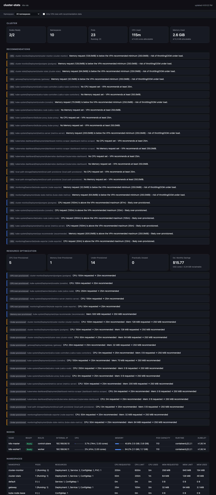

# cluster-stats

A small FastAPI app that gives a full picture of the k8s-lab cluster:
node/namespace/pod resource usage, workload health (Deployments,
DaemonSets, StatefulSets), HPA status, and VPA min/max resource
recommendations - auto-generated for every workload, not just ones
someone remembered to configure.

Talks to the Kubernetes API server directly (not Prometheus) via a
scoped ServiceAccount, so it stays accurate even if the monitoring
stack on the `monitoring` VM is down.



`k8s/03-hpa.yaml` gives the app its own real HPA (CPU-based, 1-3
replicas) - there were previously zero HPAs anywhere in the cluster,
so this is what makes the HPA table/recommendations non-empty.

## Running it

**In the cluster** (how it's actually deployed): see
[`../k8s-manifests/README.md`](../k8s-manifests/README.md)-style flow -
build+push+pre-pull via `../deploy-image.sh`, then `kubectl apply -f k8s/`.

The Service is `ClusterIP` (not directly exposed) - reachable at
`http://192.168.56.11:30090/stats/` via [`../gateway`](../gateway/),
which also serves [`cluster-monitor`](../cluster-monitor/) at
`/monitor/` on the same port. `app/static/index.html` has
`<base href="/stats/">` and every API call uses a relative (no
leading `/`) path specifically so this works regardless of the
browser's trailing slash - see the comment there if you're adding a
new one.

**Locally, against the real cluster**, for development:

```bash
kubectl proxy --port=8001 &
cd cluster-stats
pip install -r requirements.txt
K8S_API_URL=http://localhost:8001 uvicorn app.main:app --port 8500 --reload
```

`K8S_API_URL` makes `app/k8s_client.py` talk to `kubectl proxy` (which
handles auth itself) instead of the in-cluster ServiceAccount token -
no need to fake credentials for local dev.

## Tests

```bash
pip install -r requirements-dev.txt
pytest
```

Covers `app/aggregate.py`'s parsing/summarization logic (Kubernetes
resource-quantity parsing, per-namespace/per-node rollups) as pure
functions - no cluster or mocking needed.

## What it shows

| Endpoint | What |
|---|---|
| `GET /api/cluster/summary` | node/pod counts, cluster-wide CPU/mem capacity vs. used |
| `GET /api/nodes` | per-node CPU/mem usage, roles, versions |
| `GET /api/namespaces?namespace=` | per-namespace pod counts + CPU/mem + resource counts (Services, ConfigMaps, PVCs, Jobs, CronJobs, ...) |
| `GET /api/workloads?namespace=` | Deployments + DaemonSets + StatefulSets, desired/current/ready |
| `GET /api/pods?namespace=` | full pod table: node, phase, restarts, requests/limits/usage |
| `GET /api/autoscaling/hpa?namespace=` | HPA min/max/current/desired |
| `GET /api/autoscaling/vpa?namespace=&only_with_data=` | VPA recommended CPU/mem (lowerBound/upperBound) per container |
| `GET /api/recommendations?namespace=` | actionable suggestions derived from VPA + HPA state (see below) |
| `GET /api/optimization?namespace=` | Resource Optimization report - over/under-provisioned and practically-unused containers, plus an estimated cost-savings rollup (see below) |

`GET /` serves a single-page dashboard (`app/static/index.html`) over
all of the above, auto-refreshing every 15s, with namespace and
"only VPA rows with data" filters.

## The recommendation engine

`/api/recommendations` (`build_recommendations` in `app/aggregate.py`)
is the point of collecting VPA/HPA data in the first place - not just
displaying numbers, but turning them into "here's what's wrong and
what to do about it":

- **VPA-based**: for every container with a VPA recommendation, compares
  it against that workload's *actual* pod-template resource request
  (pulled straight from the Deployment/DaemonSet/StatefulSet object, not
  a running pod - avoids fragile pod-to-owner matching entirely).
  Flags three cases: no request set at all, request below the
  recommended minimum (`warning` - real risk of throttling/OOMKill), or
  above the recommended maximum (`info` - likely just wasted capacity).
  Silent when a container is already well-sized.
- **HPA-based**: flags an HPA pinned at `maxReplicas` (`warning` - could
  be silently capping real demand) and one where `minReplicas ==
  maxReplicas` (`info` - it's configured but structurally can never
  scale).

Every recommendation carries a namespace/kind/name/container so the UI
can point back at exactly what triggered it.

## Resource Optimization (`/api/optimization`, `build_resource_optimization`)

The first of the project's planned "Top 5" analysis priorities. Where
`/api/recommendations` above flags individual containers as a flat list,
this turns the same VPA/workload data into a dedicated report with
explicit buckets and a savings rollup:

- **CPU / Memory Over-Provisioned** - request is above the VPA's
  `upperBound` (same signal `build_recommendations`' "info" case already
  uses - a container flagged here agrees with what that endpoint says).
- **Under-Provisioned** - request is below the VPA's `lowerBound` - real
  risk of throttling/OOM, same signal as the existing "warning" case.
- **Practically Unused** - request is 10x or more the VPA's `target`, a
  much stricter bar than "over-provisioned" for the containers that are
  barely using any of what they've reserved.
- **Potential Savings** - sums `request - target` across every
  over-provisioned/unused container (cores and GiB), then converts that to
  a dollar figure using a configurable blended on-demand rate
  (`OPTIMIZATION_CPU_HOURLY_RATE_USD` / `OPTIMIZATION_MEM_HOURLY_RATE_PER_GIB_USD`,
  defaulting to $0.033/core-hr and $0.004/GiB-hr) x 730 hours/month.

**On "actual usage"**: this app has no metrics-history pipeline of its
own, so "recommended"/"actual usage" here is the VPA's own `target`
recommendation, not a raw time-averaged metric. The VPA recommender
already models each container's historical usage distribution - that
*is* its job - so reusing it avoids a second, fragile usage-tracking
mechanism (in particular, matching live pods back to an owning workload,
which `build_recommendations` above already deliberately avoids for the
same reason - see "Design decisions" below). Worth knowing if you're
expecting a literal 30-day rolling average: it's the VPA's own
usage-informed sizing estimate, and inherits VPA's own settling time (a
freshly-created workload's recommendation needs a few minutes of observed
usage before it means anything, same caveat as the VPA table above).
Likewise, **potential savings is an estimate against a configurable rate,
not a real cloud bill** - this lab has no billing API to query.

## Design decisions worth knowing about

**VPA auto-provisioning** (`app/vpa_manager.py`): the VPA recommender
only computes recommendations for workloads that have a
`VerticalPodAutoscaler` object pointing at them - it doesn't do this
automatically. Rather than require someone to create one per
Deployment/DaemonSet/StatefulSet, a background loop (every 60s)
creates one for anything not yet covered, always with
`updateMode: "Off"`. This only ever *observes and recommends* - it
never resizes or evicts a pod. That would need the VPA updater, which
is deliberately not installed (see the cluster-wide VPA install notes
in the repo root README).

**No Secrets counting**: `/api/namespaces` counts Services, ConfigMaps,
PVCs, Jobs, and CronJobs per namespace, but deliberately not Secrets.
RBAC grants a verb+resource, not a specific representation - a
ServiceAccount with `list` on `secrets` can always be used to read full
secret data via a normal request, regardless of what content-type this
app happens to ask for. Not worth that blast radius just to show a
count.

**Metadata-only fetches**: everything this app only *counts* (Services,
ConfigMaps, PVCs, Jobs, CronJobs) is fetched via Kubernetes'
`PartialObjectMetadataList` representation (`app/k8s_client.py`'s
`get_metadata_only`) - names/namespaces/labels only, never spec or
data, even though the app never inspects most of those fields anyway.
One real quirk found the hard way: an *empty* `PartialObjectMetadataList`
encodes as `"items": null`, not `"items": []` - handled defensively,
see the comment next to `get_metadata_only`.

**RBAC** (`k8s/01-rbac.yaml`): read-only cluster-wide on the resources
above, plus create-only on VerticalPodAutoscaler objects. Nothing else -
no update/delete/patch on anything, no Secrets access at all.
